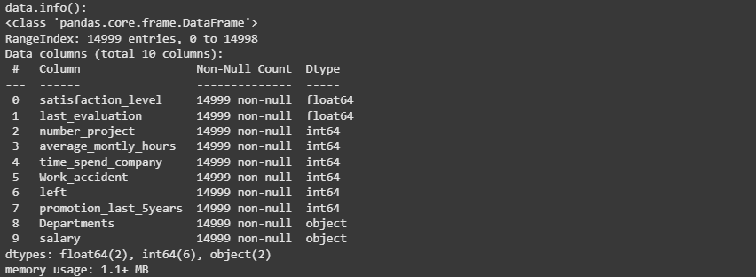

# Implementation-of-Decision-Tree-Classifier-Model-for-Predicting-Employee-Churn

## AIM:
To write a program to implement the Decision Tree Classifier Model for Predicting Employee Churn.

## Equipments Required:
1. Hardware – PCs
2. Anaconda – Python 3.7 Installation / Jupyter notebook

## Algorithm
1. Import pandas
2. Import Decision tree classifier
3. Fit the data in the model
4. Find the accuracy score

## Program:

### Program to implement the Decision Tree Classifier Model for Predicting Employee Churn.

__Developed by: LAKSHMIDHAR N__

__Register Number: 212224230138__

```py
import pandas as pd
data=pd.read_csv("Employee.csv")
print("data.head():")
data.head()
```

```py
print("data.info():")
data.info()
```

```py
print("isnull() and sum():")
data.isnull().sum()
```

```py
print("data value counts():")
data["left"].value_counts()
```

```py
print("data.head() for Salary:")
data["salary"]=le.fit_transform(data["salary"])
data.head()
```

```py
print("x.head():")
x=data[["satisfaction_level","last_evaluation","number_project","average_montly_hours","time_spend_company","Work_accident","promotion_last_5years","salary"]]
x.head()
```

```py
y=data["left"]
from sklearn.model_selection import train_test_split
x_train,x_test,y_train,y_test=train_test_split(x,y,test_size=0.2,random_state=100)
from sklearn.tree import DecisionTreeClassifier
dt=DecisionTreeClassifier(criterion="entropy")
dt.fit(x_train,y_train)
y_pred=dt.predict(x_test)
```

```py
print("Accuracy value:")
from sklearn import metrics
accuracy=metrics.accuracy_score(y_test,y_pred)
accuracy
```

```py
print("Data Prediction:")
dt.predict([[0.5,0.8,9,260,6,0,1,2]])
```

```py
from sklearn.tree import plot_tree
import matplotlib.pyplot as plt

plt.figure(figsize=(8,6))
plot_tree(dt, feature_names=x.columns, class_names=['salary', 'left'], filled=True)
plt.show()
```
## Output:





## Result:
Thus the program to implement the  Decision Tree Classifier Model for Predicting Employee Churn is written and verified using python programming.
